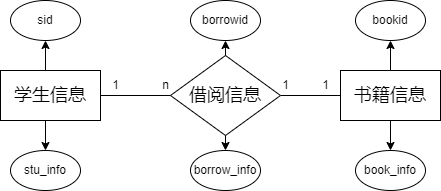

# LibraryManageSystem

## 实战：基于Mybatis+JUL+Lombok+Maven的图书管理系统（带单元测试）

### 项目需求：

+ 在线录入学生信息和书籍信息
+ 查询书籍信息列表
+ 查询学生信息列表
+ 查询借阅信息列表
+ 完整的日志系统

---

+ [x] 根据需求设计数据库表结构

+ [x] 创建相应数据库表
    + [x] 创建测试用例
+ [x] 创建并配置Maven项目
+ [x] 编写Mybatis
+ [x] 编写JUL
+ [x] 编写并进行单元测试
+ [x] 编写Terminal指令台
+ [x] 编写运行日志
+ [x] 重构为SqlUtil类

---

TODO:
+ [ ] 理解Mysql中触发器的使用，本例中学生/书籍删除会影响借阅信息
+ [ ] 理解外键的限制
